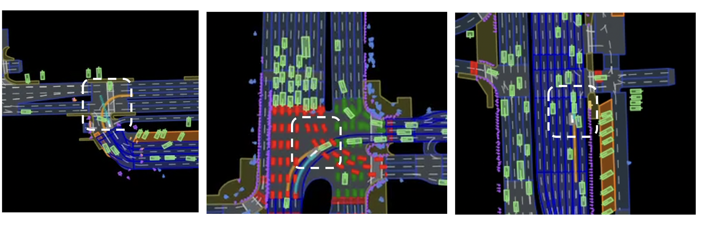
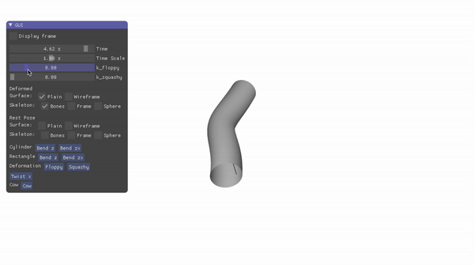
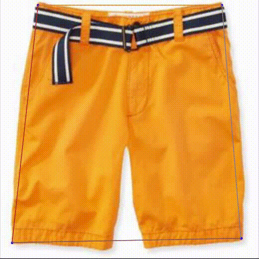



### [Adversarial corner case generation for motion planning](https://github.com/pegah-kh/kinematic_adversary_agents/blob/main/report.pdf)
  
[Code](https://github.com/pegah-kh/kinematic_adversary_agents),
[Report](https://github.com/pegah-kh/kinematic_adversary_agents/blob/main/report.pdf)

We attempted to develop a framework to stress-test vehicle planners by generating safety-critical driving scenarios. Recognizing that real-world scenarios are rare and costly, we used a realistic simulator, [nuPlan](https://www.nuscenes.org/nuplan) to create scenarios aimed at exposing potential collision risks. Building on the method introduced by [Han et al., 2022](https://arxiv.org/abs/2204.13683), we adapted it to a more complex environment with a wider range of agents and behaviors.

### [Simplified Velocity Skinning](https://github.com/pegah-kh/Simple-Velocity-Skinning)
  
[Code](https://github.com/pegah-kh/Simple-Velocity-Skinning),
[Report](https://github.com/pegah-kh/Simple-Velocity-Skinning/tree/master/report_and_demonstration)

This was a course project that I truly enjoyed. It's about making animation looking more realistic and loose, by adding exagerated deformation triggered by skeletal velocity on top of standard skinning animation.
The code uses a [CGP library](https://github.com/drohmer/CGP) developped by the professor of the course, and is a simplification of the work done in one of his papers, [Velocity Skinning](https://velocityskinning.com/).

### [Landmark Localization for a Fashion Dataset: A PIFPAF Plugin](https://github.com/pegah-kh/pifpaf_deepfashion)
  
[Code](https://github.com/pegah-kh/pifpaf_deepfashion)

This is a simple plugin of [OpenPifPaf](https://openpifpaf.github.io/intro.html) for detecting landmarks (main points of interest such as the end of sleeves in a shirt ...) in various clothing items.

% 

